Plotting occultation maps
~~~~~~~~~~~~~~~~~~~~~~~~~

To generate prediction or post-fit occultation maps, the function to be
used is *sora.prediction.plot_occ_map(*). This function receives many
required parameters that states the orientation and path of the
occultation. When using this function within sora.occ_fit.plot_occ_map()
or sora.Prediction.plot_occ_map() all the required parameters are
automatically send to the original function. But the user is still able
to pass many kwargs are used to configure the occultation map. Without
any configuration parameter, the map will have the plain view of the
Earth and path. For example.

.. code:: python

   ### from a Prediction Table of Phoebe
   occs.plot_occ_map()
   ## Phoebe_2018-06-19T04:36:56.400.png generated

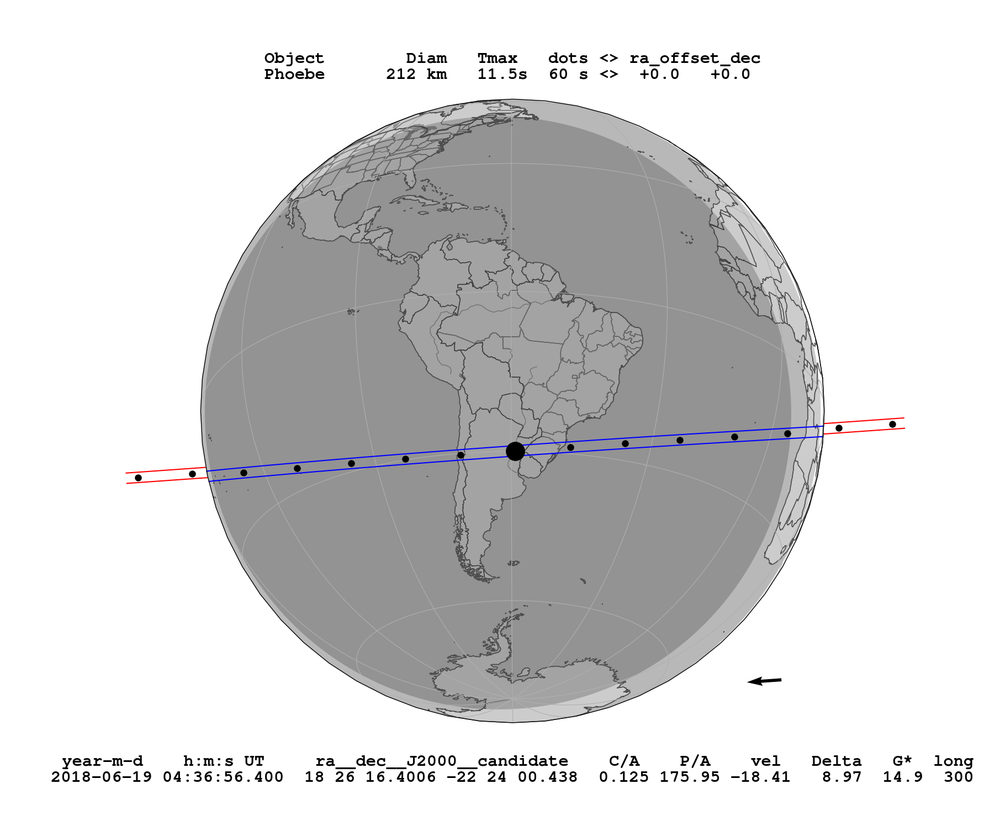

**Figure 1:** Occultation map of Phoebe, plain view, default configuration.

-  nameimg: Change the name of the imaged saved.

   .. code:: python

      occs.plot_occ_map(nameimg='Phoebe_teste')
      ## Phoebe_teste.png generated

-  resolution: Identify the type of cartopy feature resolution. "1"
   means a resolution of "10m", "2" a resolution of "50m" and "3" a
   resolution of "100m". The default is "2". .

   .. code:: python

      occs.plot_occ_map(resolution=1)
      occs.plot_occ_map(resolution=3)

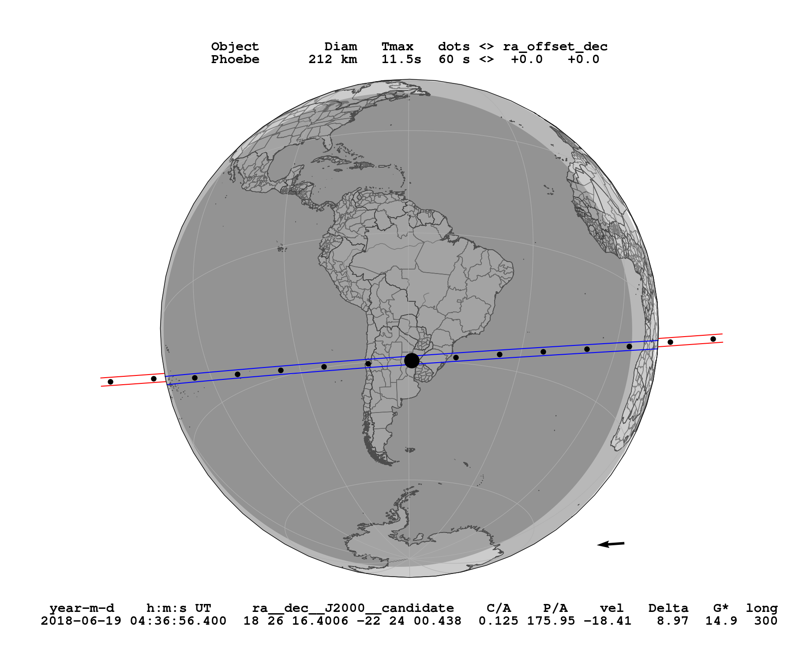
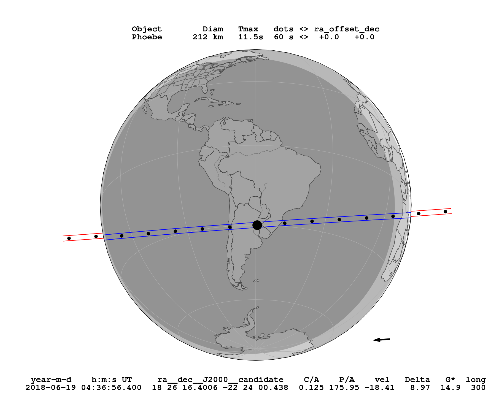

**Figure 2:** Maps with feature resolution 1 = 10m (left) and 3 = 100m 
(right).

-  states: Plots the state division of the countries. The states of some
   countries will only be shown depending on the resolution. For
   instance, USA states are shown for all resolutions, but Brazilian
   states will be shown only for resolution equal to "1" or "2". This is
   a cartopy characteristics and cannot be changed. Default=True.

   .. code:: python

      occs.plot_occ_map(states=True)
      occs.plot_occ_map(states=False)

-  zoom: Zooms in or out of the map. It must be a number. For the number
   given in zoom, the dimensions of the map will be divided by that
   number. For instance, if zoom=2, it will be shown the Earth divided
   by 2 in X and Y. Default=1. .

   .. code:: python

      occs.plot_occ_map(zoom=2)
      occs.plot_occ_map(zoom=0.5)

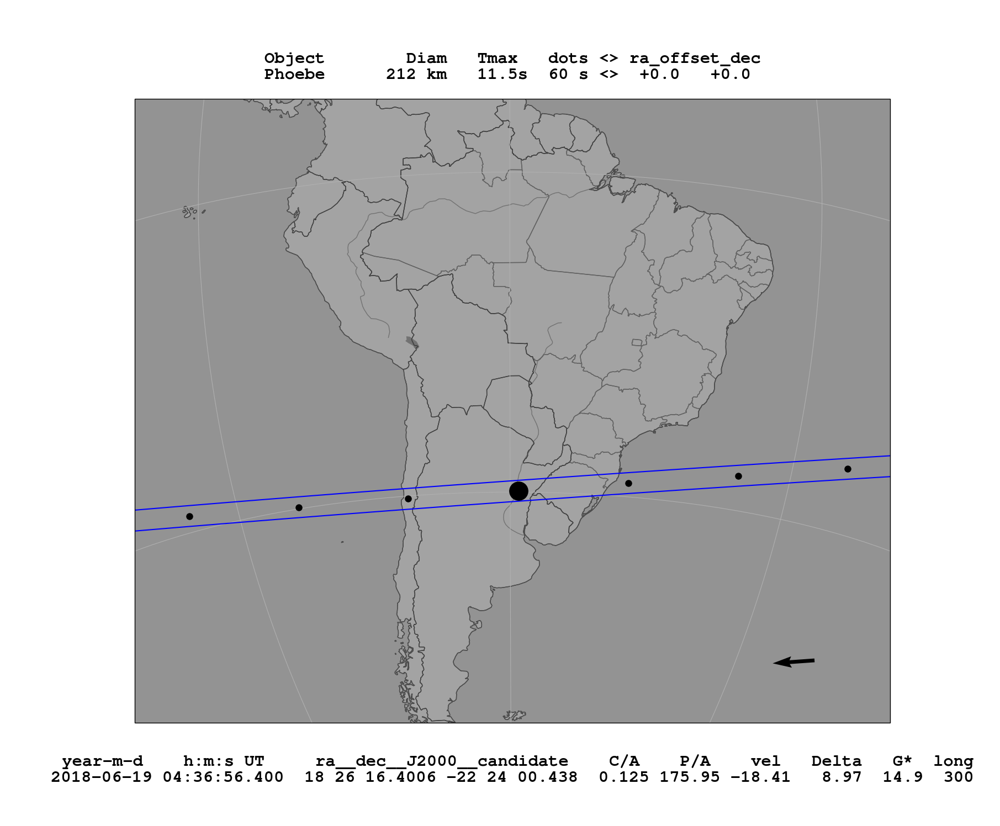
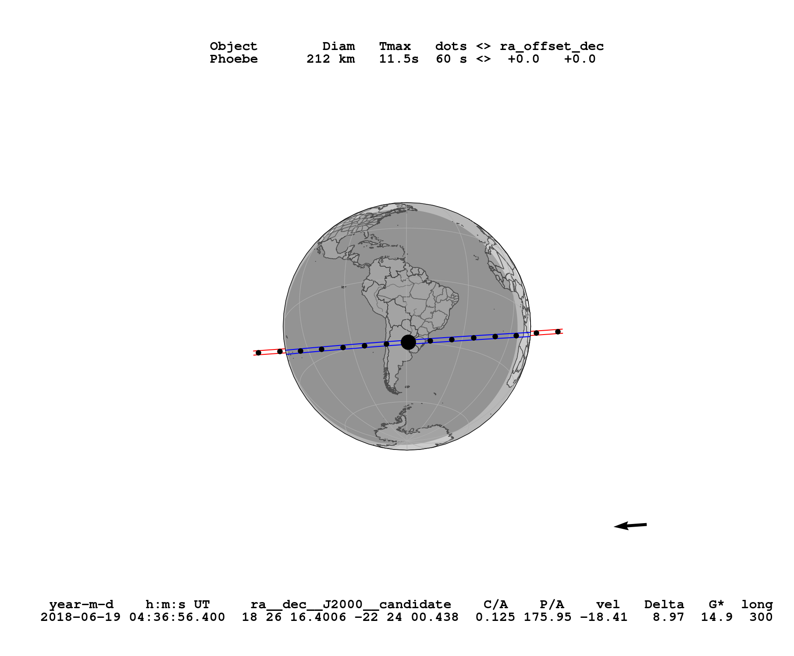

**Figure 3:** Maps with zoom=2 (left) and zoom=0.5 (right).

-  centermap_geo: Center the map given coordinates in longitude and
   latitude. It must be a list with two numbers. Default=None. If
   coordinate is on the other side of the map, it gives an error.
   (left).

-  centermap_delta: Displace the center of the map given displacement in
   X and Y, in km. It must be a list with two numbers. Default=None.
   (right).

   centermap_geo and centermap_delta are only a displacement on original
   projection. If Earth rotation is needed, please see centerproj.

   .. code:: python

      occs.plot_occ_map(centermap_geo=[0,-40], zoom=2)
      # Center the map on longitude=0.0 deg and latitude=-40 deg.
      occs.plot_occ_map(centermap_delta=[5000,-1000], zoom=2)
      # Displace the center of the map 5000 km East and 1000 km South

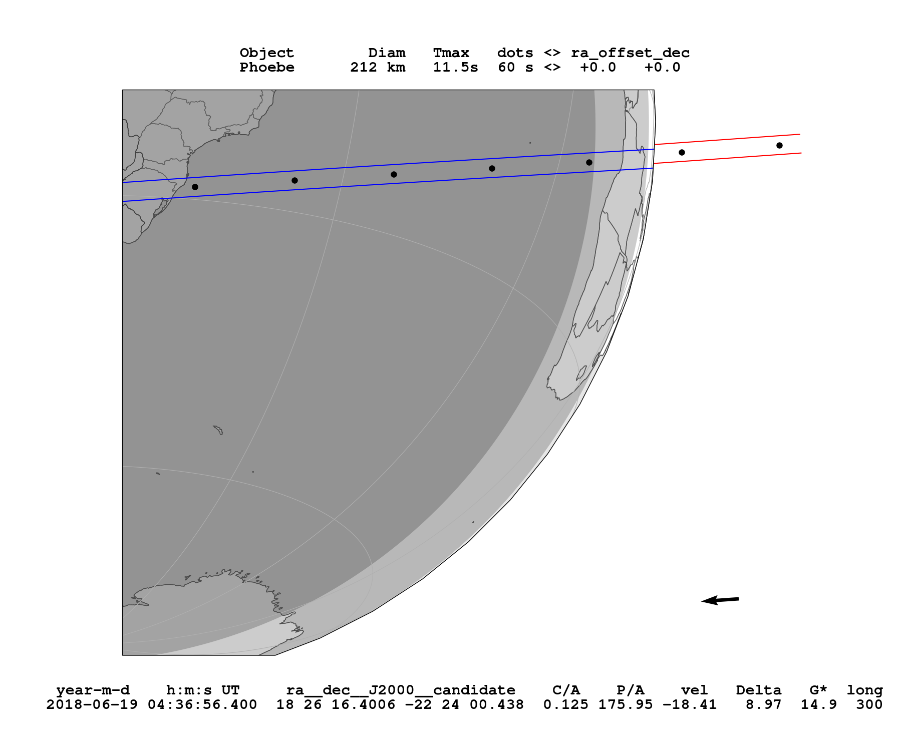
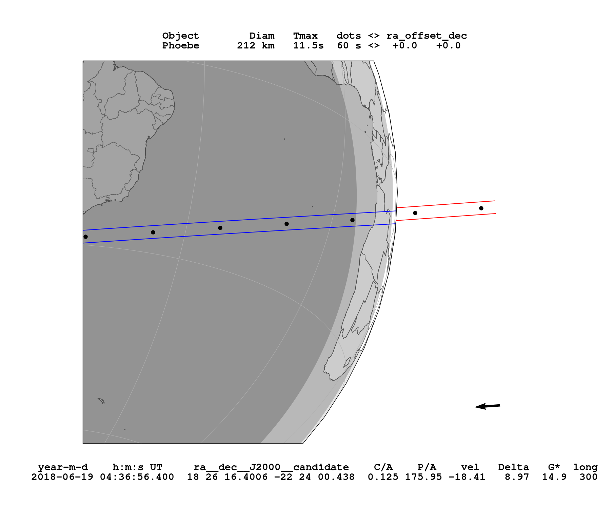

**Figure 4:** Maps centered on longitude=0.0º and latitude=-40º (left) 
and with center displaced by 5000 km East and 1000 km South (right)

-  centerproj: Rotates the Earth to show occultation with the center
   projected at a given longitude and latitude. (left).

-  labels: Plots text above and below the map with the occultation
   parameters. Default=True. (right).

-  meridians and parallels: Plots lines representing the meridians and
   parallels given such interval. Default=30 for both parameters. So it
   will plot lines representing these values each 30º. (right).

   .. code:: python

      occs.plot_occ_map(centerproj=[0,-40])
      # Rotate to center the map projection on longitude=0.0 deg and latitude=-40 deg.
      occs.plot_occ_map(labels=False, meridian=10, parallels=10, zoom=2)
      # Displace the center of the map 5000 km East and 1000 km South

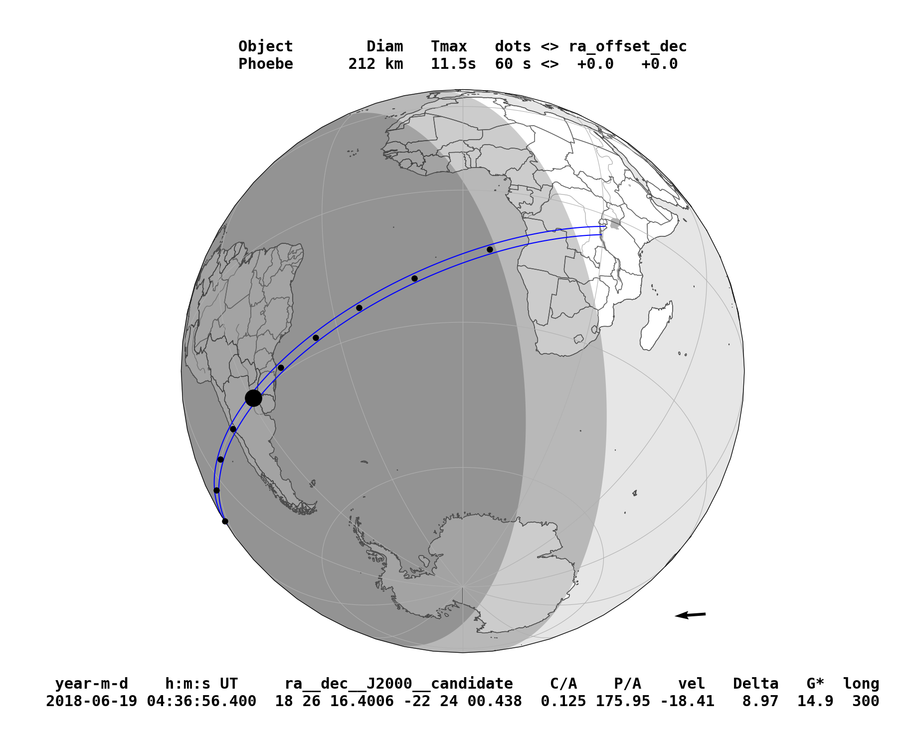

**Figure 5:** Map with rotated projection to longitude=0.0º and 
latitude=-40º. 

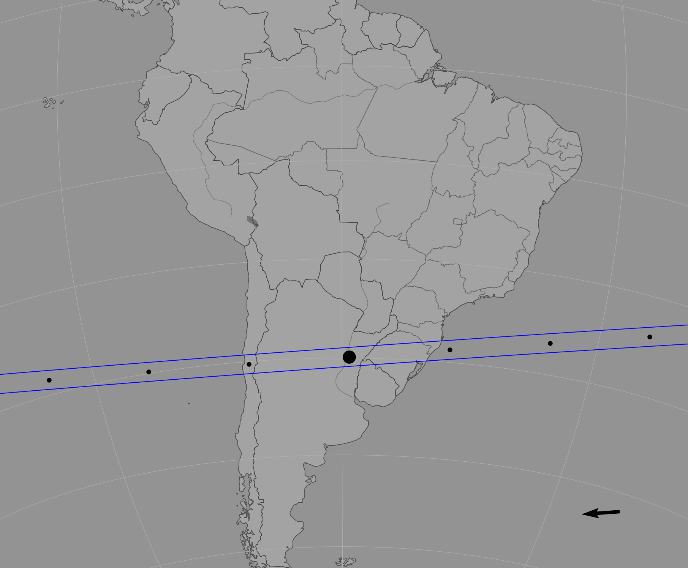

**Figure 6:** Map without labels, with meridians and parallels 
each 10º.

-  sites: Plots site positions in map. It must be a python dictionary
   where the key is the name of the site, and the value is a list with
   longitude, latitude, delta_x, delta_y and color. *delta_x* and
   *delta_y* are displacement, in km, from the point of the site in the
   map and the name. *color* is the color of the point. (left).

-  countries: Plots the names of countries. It must be a python
   dictionary where the key is the name of the country and the value is
   a list with longitude and latitude of the lower left part of the
   text. (right).

   .. code:: python

      sites = {}
      sites['Foz'] = [ -54.5936, -25.4347, 10, 10, 'blue']
      sites['SOAR'] = [ -70.73919, -30.238027, 10,10,'green']
      sites['La Silla'] = [-70.7393888, -29.254611, 10,10,'blue']
      occs.plot_occ_map(zoom=5, labels=False, sites=sites)

      countries = {}
      countries['Brazil'] = [-52.5983973, -23.5570511]
      countries['Argentina'] = [-67.2088692, -35.1237852]
      occs.plot_occ_map(zoom=3, labels=False, countries=countries, states=False)

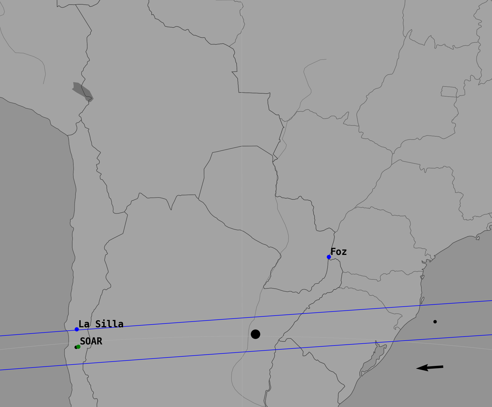

**Figure 7:** Map with the location of sites.

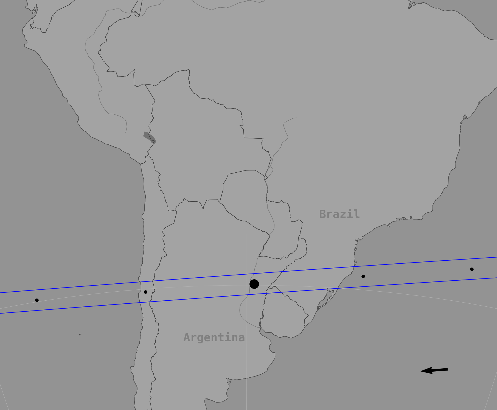

**Figure 8:**  Map with the name of countries (right)

-  offset: applies an offset to the ephemeris, calculating new CA and
   instant of CA. It is a pair of delta_RA*cosDEC and delta_DEC. (left).

-  mapstyle: Define the color style of the map. 1 is the default black
   and white scale. 2 is a colored map. (right).

   .. code:: python

      occs.plot_occ_map(zoom=3, offset=[-40,50])
      # Applies offsets of -40 mas in Delta_alpha_cos_delta and 50 mas in Delta_delta
      occs.plot_occ_map(zoom=3, mapstyle=2)
      # Plots a colored map, without offset

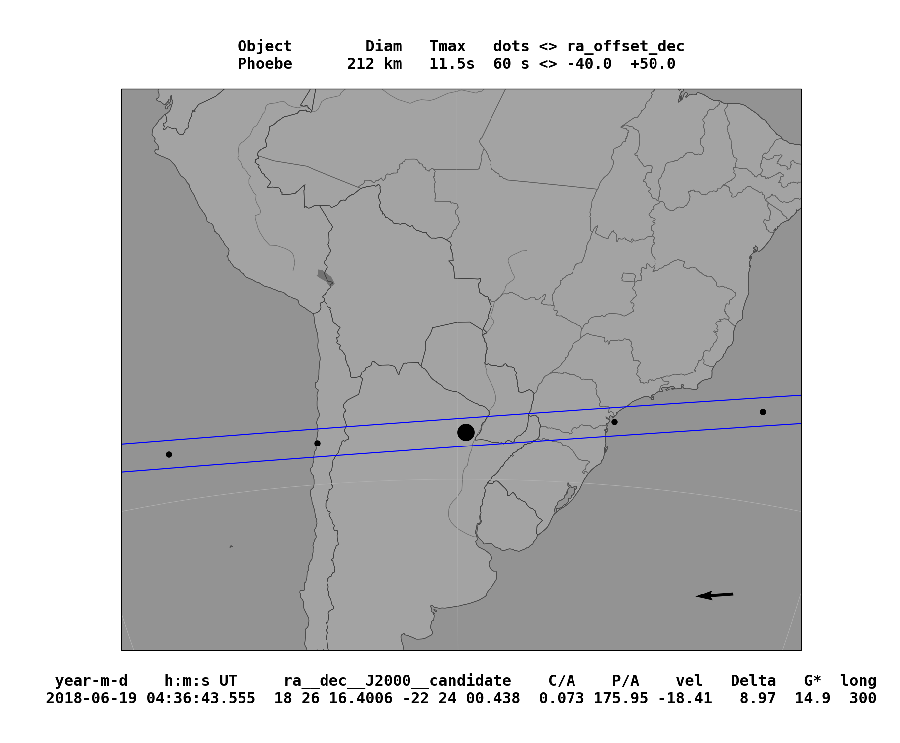

**Figure 9:** Map with an offset applied.

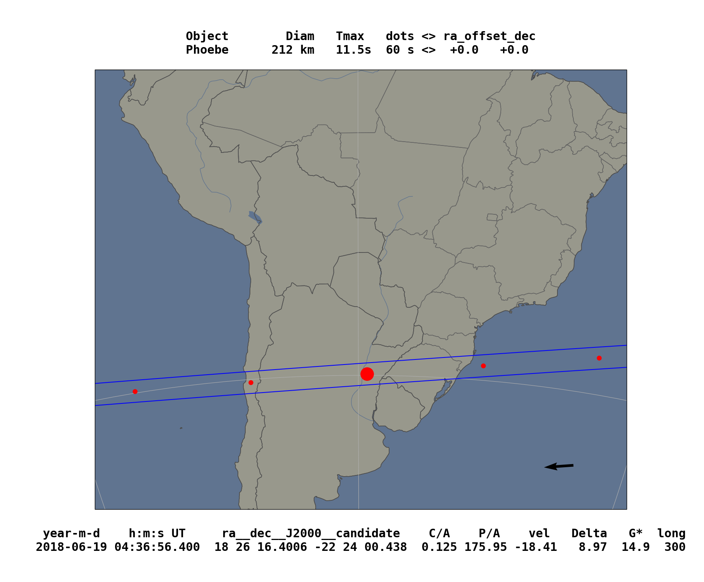

**Figure 10:** Map with colours.

-  error: Ephemeris error in mas. It plots a dashed line representing
   radius + error. To change the color of these lines, the name of the
   color must be given to lncolor. (left).

-  ring: Similarly to error, it plots a dashed line representing the
   location of a ring. It is given in km, from the center. To change the
   color of these lines, the name of the color must be given to rncolor.

-  atm: Similarly to error, it plots a dashed line representing the
   limit of an atmosphere. It is given in km, from the center. To change
   the color of these lines, the name of the color must be given to
   atmcolor.

-  heights: It plots a circular dashed line showing the locations where
   the observer would observe the occultation at a given height above
   the horizons. This must be a list. To change the color of these
   lines, the name of the color must be given to hcolor. (right).

   .. code:: python

      occs.plot_occ_map(zoom=3, labels=False, error=15)
      # Shows an error bar of 15 mas
      occs.plot_occ_map(heights=[30])
      # Shows where the observer will see the occultation with a 30deg height above the horizons.

.. image:: ../../images/maps/map_10.png
  :width: 800
  :align: center
  :alt: Example Map

**Figure 11:** Map showing the error bar.

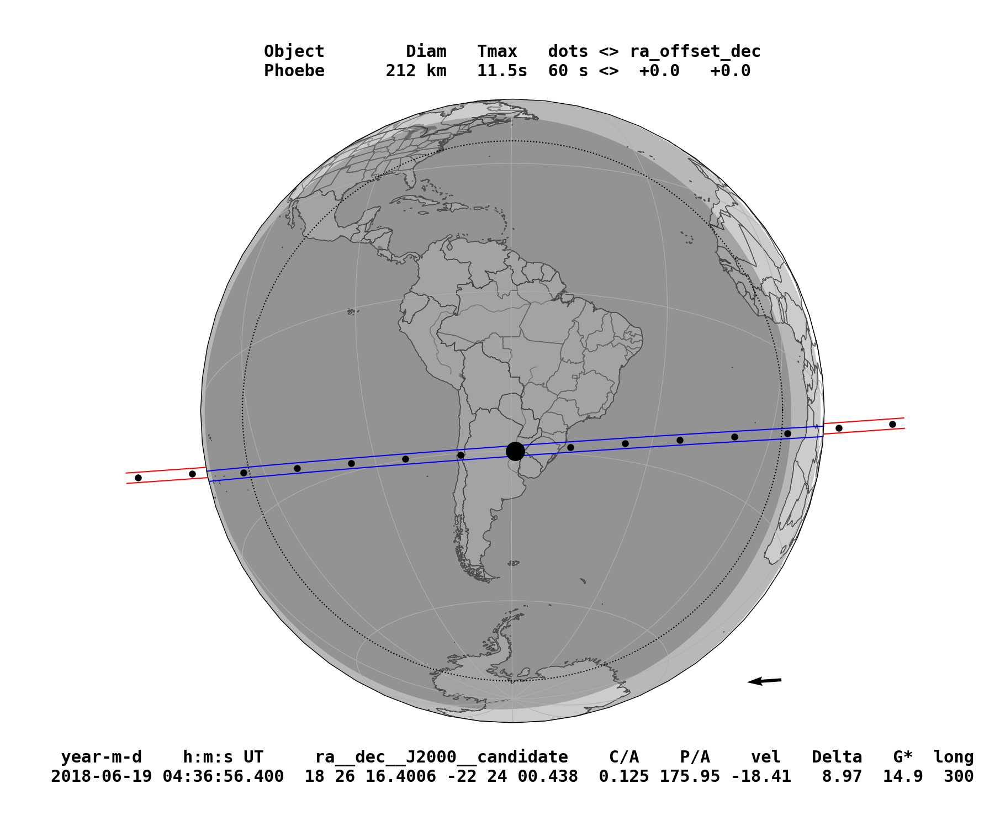

**Figure 12:**  Map with the location that would observe the event 
with 30º above the horizons.

-  mapsize: The size of figure, in cm. It must be a list with two
   values. Default = [46.0, 38.0].

-  cpoints: Interval for the small points marking the center of shadow,
   in seconds. Default=60. To change the color of these points, the name
   of the color must be given to ptcolor.

-  alpha: The transparency of the night shade, where 0.0 is full
   transparency and 1.0 is full black. Default = 0.2.

-  fmt: The format to save the image. It is parsed directly by
   matplotlib.pyplot. Default = ’png’.

-  dpi: "Dots per inch". It defines the quality of the image. Default =
   100.

-  nscale, cscale, sscale and pscale: Arbitrary scale for the size for
   the name of the site, for the name of the country, for the size of
   point of the site, and the size of the points that represent the
   center of the shadow, respectively. This scale is arbitrary and is
   proportional to the size of the image.

-  lncolor, outcolor: To change the color of the line that represents
   the limits of the shadow over Earth and the color of the lines that
   represents the limits of the shadow outside Earth, respectively.

