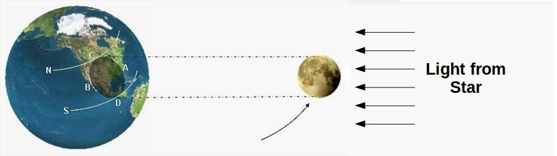
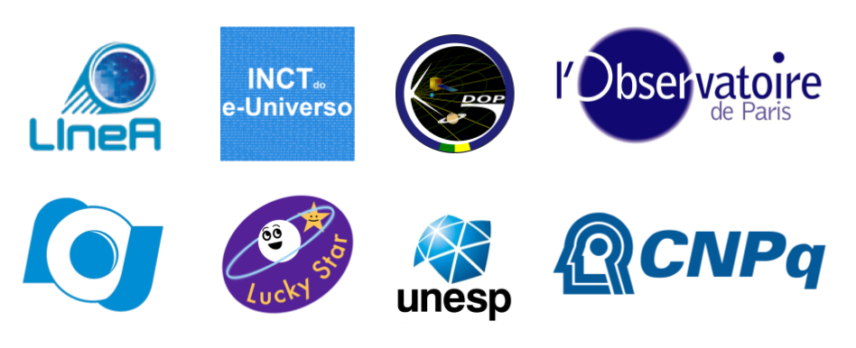

.. _Sec:overview:

|
|

Overview
========

Stellar Occultations
--------------------

A stellar occultation occurs when a solar system object passes in front
of a star for an observer on Earth, and its shadow causes a temporary
drop in the observed flux of the star. This technique allows the
determination of sizes and shapes with kilometre precision and to obtain
characteristics of the object, such as its albedo, the presence of an
atmosphere, rings, jets, or other structures around the body (Sicardy et
al. |BS2011|, |BS2016|, Braga-Ribas et al. |FBR2013|, |FBR2014|, |FBR2019|,
Dias-Oliveira et al., |ADO2015|, Benedetti-Rossi et al., |GBR2016|, |GBR2019|,
Ortiz et al., |JLO2015|, |JLO2017|, |JLO2020|, Leiva et al., |RL2017|, Bérard et al., 
|DB2017|, Morgado et al., |BEM2019|, Gomes-Júnior et al., |ARGJ2020|, 
Souami et al., |DS2020|, Santos-Sanz et al., |PSS2021|) 
or even the detection of topographic features (Dias-Oliveira et al. |ADO2017|).

**Figure 1:** Illustration of a stellar occultation geometry. Original source: 
IOTA, editted by G. Benedetti-Rossi.

The SORA library
----------------

SORA is a Python-based, object-oriented library for optimal analysis of
stellar occultation data. The user can use this library to build pipelines 
to analyse their stellar occultation’s data. It includes processes starting 
on the prediction of such events to the resulting size, shape and position of
the Solar System object. The main modules available at version 0.2
are: **star**, **body**, **observer**, **lightCurve** and
**occultation**. It is important to note that new modules and other 
improvements and implementations can be available in future versions.

A stellar occultation is defined by the occulting body (**Body**), the
occulted star (**Star**), and the time of the occultation. On the other
hand, each observational station (**Observer**) will be associated with
their light curve (**LightCurve**). SORA has tasks that allow the user
to determine the immersion and emersion times and project them to the
tangent sky plane, using the information within the **Observer**,
**Body** and **Star** Objects. That projection will lead to chords that
will be used to obtain the object’s apparent size, shape and position at
the moment of the occultation. Automatic processes were developed for
optimising the reduction of typical events. However, users have full
control over the parameters and methods and can make changes in every
step of the processes.

The Classes developed within SORA were built as an integrated
system, and they are controlled by the **Occultation** Class.
Combining these Classes and the functions therein, the user can
perform the complete data reduction, pre- and post-occultation. 
Jupyter-Notebooks with the features of each Class can be found in the 
example folder.

Acknowledgements
----------------

The SORA library is hosted on a |GitHub| repository. It was developed with support 
of the |LuckyStar|, that agglomerates the efforts of the Paris, Granada, and Rio
teams :superscript:`(1)`. The |LuckyStar| is funded by the ERC (European Research Council) 
under the European Community’s H2020 (2014-2020/ERC Grant Agreement No. 669416). Also, 
this project is supported by |LIneA| (Laboratório Interinstitucional de e-Astronomia), 
INCT do e-Universo (CNPQ grants 465376/2014-2), by FAPESP (proc. 2018/11239-8), by CNPQ 
(proc. 300472/2020-0, 150612/2020-6), and by CAPES-PRINT/UNESP (88887.571156/2020-00) 
in Brazil.

**Figure 2:** The SORA team thanks the following institutions, groups and projects for their 
support: ERC Lucky Star, LIneA/Brazil, INCT do e-Universo/Brazil, UNESP/Brazil, GDOP/Brazil, 
Observatoire de Paris/France, Observatório Nacional/Brazil and CNPq/Brazil.

:superscript:`(1)` The Paris, Granada, and Rio teams are professionals astronomers affiliated mainly in the following 
institutions:

* LESIA - Observatoire de Paris, France;
* Institut Polytechnique des Sciences Avancées, France;
* IMCCE - Observatoire de Paris, France;
* Instituto de Astrofísica de Andalucía, Spain;
* Laboratório Interinstitucional de e-Astronomia, Brazil;
* INCT do e-Universo, Brazil;
* Observatório Nacional/MCTI, Brazil;
* Federal University of Technology - Paraná, Brazil;
* UNESP - São Paulo State University, Brazil;
* Universidade Federal do Rio de Janeiro - Observatório do Valongo, Brazil;

.. |BS2011| raw:: html

   <a href="https://ui.adsabs.harvard.edu/abs/2011Natur.478..493S/abstract" target="_blank">2011</a>

.. |BS2016| raw:: html

   <a href="https://ui.adsabs.harvard.edu/abs/2016ApJ...819L..38S/abstract" target="_blank">2016</a>

.. |FBR2013| raw:: html

   <a href="https://ui.adsabs.harvard.edu/abs/2013ApJ...773...26B/abstract" target="_blank">2013</a>

.. |FBR2014| raw:: html

   <a href="https://ui.adsabs.harvard.edu/abs/2014Natur.508...72B/abstract" target="_blank">2014</a>

.. |FBR2019| raw:: html

   <a href="https://ui.adsabs.harvard.edu/abs/2019JPhCS1365a2024B/abstract" target="_blank">2019</a>

.. |ADO2015| raw:: html

   <a href="https://ui.adsabs.harvard.edu/abs/2015ApJ...811...53D/abstract" target="_blank">2015</a>

.. |ADO2017| raw:: html

   <a href="https://ui.adsabs.harvard.edu/abs/2017AJ....154...22D/abstract" target="_blank">2017</a>

.. |GBR2016| raw:: html

   <a href="https://ui.adsabs.harvard.edu/abs/2016AJ....152..156B/abstract" target="_blank">2016</a>

.. |GBR2019| raw:: html

   <a href="https://ui.adsabs.harvard.edu/abs/2019AJ....158..159B/abstract" target="_blank">2019</a>

.. |JLO2015| raw:: html

   <a href="https://ui.adsabs.harvard.edu/abs/2015EPSC...10..230O/abstract" target="_blank">2015</a>

.. |JLO2017| raw:: html

   <a href="https://ui.adsabs.harvard.edu/abs/2017Natur.550..219O/abstract" target="_blank">2017</a>

.. |JLO2020| raw:: html

   <a href="https://ui.adsabs.harvard.edu/abs/2020A%26A...639A.134O/abstract" target="_blank">2020</a>

.. |RL2017| raw:: html

   <a href="https://ui.adsabs.harvard.edu/abs/2017AJ....154..159L/abstract" target="_blank">2017</a>

.. |DB2017| raw:: html

   <a href="https://ui.adsabs.harvard.edu/abs/2017AJ....154..144B/abstract" target="_blank">2017</a>

.. |BEM2019| raw:: html

   <a href="https://ui.adsabs.harvard.edu/abs/2019A%26A...626L...4M/abstract" target="_blank">2019</a>

.. |ARGJ2020| raw:: html

   <a href="https://ui.adsabs.harvard.edu/abs/2020MNRAS.492..770G/abstract" target="_blank">2020</a>

.. |DS2020| raw:: html

   <a href="https://ui.adsabs.harvard.edu/abs/2020A%26A...643A.125S/abstract" target="_blank">2020</a>

.. |PSS2021| raw:: html

   <a href="https://ui.adsabs.harvard.edu/abs/2021MNRAS.501.6062S/abstract" target="_blank">2021</a>

.. |GitHub| raw:: html

   <a href="https://github.com/riogroup/SORA" target="_blank">GitHub</a>

.. |LuckyStar| raw:: html

   <a href="https://lesia.obspm.fr/lucky-star/" target="_blank">ERC LuckyStar</a>

.. |LIneA| raw:: html

   <a href="https://www.linea.gov.br/" target="_blank">LIneA</a>

