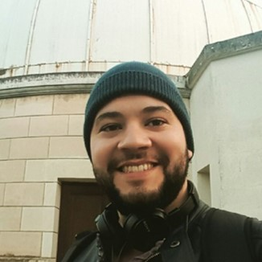
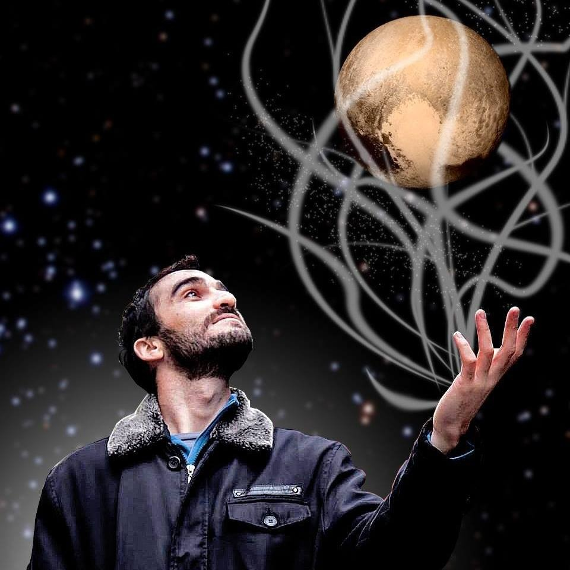

.. _Sec:team:

.. image:: images/SORA_logo.png
  :width: 500
  :align: center
  :alt: SORA: Stellar Occultation Reduction and Analysis

|
|

About Us
========

The SORA package was developed with support of the |LuckyStar|, that agglomerates 
the efforts of the Paris, Granada, and Rio teams. The |LuckyStar| is funded by the
ERC (European Research Council) under the European Community’s H2020 (2014-2020/ERC 
Grant Agreement No. 669416). Also, this project is supported by |LIneA| (Laboratório 
Interinstitucional de e-Astronomia), INCT do e-Universo (CNPQ grants 465376/2014-2), 
by FAPESP (proc. 2018/11239-8) and by CNPQ (proc. 300472/2020-0), Brazil.

.. |LuckyStar| raw:: html

   <a href="https://lesia.obspm.fr/lucky-star/" target="_blank"> ERC LuckyStar</a>

.. |LIneA| raw:: html

   <a href="https://www.linea.gov.br/" target="_blank"> LIneA</a>

SORA Team
---------

.. table::
   :widths: 30 50

   +--------+---------------------------------------------------+
   | Photo  | Details                                           |
   +========+===================================================+
   |        | | **Dr. Altair Ramos Gomes Júnior**               |
   | |pic1| | | Postdoctoral Researcher                         |
   |        | | UNESP-Campus Guaratinguetá and LIneA/Brazil     |
   +--------+---------------------------------------------------+
   |        | | **Dr. Bruno Eduardo Morgado**                   |
   | |pic2| | | Postdoctoral Researcher                         |
   |        | | Observatório Nacional and LIneA/Brazil          |
   +--------+------------+--------------------------------------+
   |        | | **Dr. Gustavo Benedetti Rossi**                 |
   | |pic3| | | Postdoctoral Researcher                         |
   |        | | UNESP-Campus Guaratinguetá and LIneA/Brazil     |
   +--------+------------+--------------------------------------+
   |        | | **Dr. Rodrigo Carlos Boufleur**                 |
   | |pic4| | | Postdoctoral Researcher                         |
   |        | | LIneA and INCT do e-Universo/Brazil             |
   +--------+------------+--------------------------------------+
   |        | | **Msc. Flavia Luane Rommel**                    |
   | |pic5| | | PhD Student                                     |
   |        | | Observatório Nacional and LIneA/Brazil          |
   +--------+------------+--------------------------------------+
   |        | | **Dr. Martin Banda Huarca**                     |
   | |pic6| | | Postdoctoral Researcher                         |
   |        | | LIneA and INCT do e-Universo/Brazil             |
   +--------+------------+--------------------------------------+

   

   

   

   
Contact us
----------

Any question or suggestion can be added to our |GitHub| Issue webpage 
or addressed to our mailbox **rio.occteam@gmail.com**. The SORA team
thanks for your suggestions and we are looking forward to improve our
code with yours insights. 

.. |GitHub| raw:: html

   <a href="https://github.com/riogroup/SORA" target="_blank"> GitHub</a>

